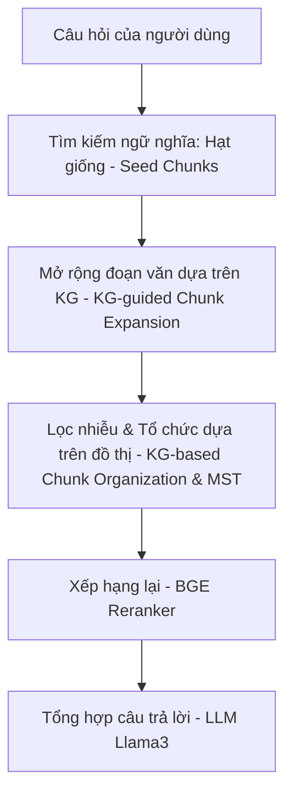

# Tổng quan Dự án KG2RAG (Knowledge Graph-Guided Retrieval Augmented Generation)

Dự án này là mã nguồn chính thức cho nghiên cứu **"Knowledge Graph-Guided Retrieval Augmented Generation"** được công bố tại hội nghị **NAACL 2025** bởi nhóm tác giả thuộc Đại học Nam Kinh (Nanjing University) và Alibaba Group.

## 1. Vấn đề giải quyết & Ý tưởng cốt lõi

Trong các hệ thống RAG truyền thống:
* **Hạn chế**: Việc tìm kiếm tài liệu bổ trợ chủ yếu dựa trên so khớp ngữ nghĩa vector (semantic similarity) trên từng đoạn văn bản riêng lẻ (isolated chunks), bỏ qua các liên kết thực thể (entity relationships) mang tính logic giữa chúng. Điều này dễ dẫn đến thiếu thông tin bổ trợ quan trọng khi trả lời các câu hỏi phức tạp (multi-hop QA).
* **Giải pháp của $KG^2RAG$**: Sử dụng đồ thị tri thức (Knowledge Graph - KG) để kết nối các đoạn văn bản độc lập lại với nhau thông qua mối quan hệ thực thể (triplets: `Subject - Relation - Object`).



---

## 2. Kiến trúc & Cấu trúc Thư mục

Thư mục dự án bao gồm:

* **`code/`**: Mã nguồn chính để vận hành RAG.
  * **`kg_rag_distractor.py`**: Chạy thử nghiệm trên dữ liệu có chứa nhiễu (distractor setting) cho HotpotQA và MuSiQue.
  * **`kg_rag_full.py`**: Chạy RAG hoàn chỉnh trên cơ sở dữ liệu lớn (full wiki setting) sử dụng cơ sở dữ liệu vector.
  * **`preprocess/`**: Các script trích xuất các bộ ba thực thể (triplets) từ văn bản thô sử dụng LLM qua Ollama.
    * `hotpot_extraction.py`, `musique_extraction.py`, `trivia_extraction.py`.
  * **`util/`**: Chứa các lớp xử lý phụ trợ cho hệ thống.
    * `kg_post_processor.py`: Nơi thực hiện phép Mở rộng và Lọc đồ thị.
    * `kg_response_synthesizer.py`: Lớp tùy chỉnh cách LLM kết hợp thông tin và sinh văn bản.
    * `prompt_helper.py`: Hỗ trợ đóng gói prompt tránh tràn ngữ cảnh (context window window).
* **`data/`**: Chứa các file dữ liệu (JSON/JSONL) và thư mục lưu trữ đồ thị tri thức con (sub-KGs) đã trích xuất.
* **`model/`**: Hướng dẫn cài đặt Ollama (`llama3:8b`) và tải mô hình xếp hạng lại `bge-reranker-large`.

---

## 3. Các bước xử lý chi tiết (Pipeline hoạt động)

### Bước 1: Trích xuất Triplet (Tiền xử lý)
Trước khi chạy RAG, hệ thống dùng Llama 3 qua Ollama để duyệt qua các đoạn văn bản trong dataset và trích xuất các bộ ba tri thức dưới dạng:
`<Thực thể chính (Subject) ## Mối quan hệ (Relation) ## Thực thể phụ (Object)>`
Ví dụ: `<Scott Derrickson ## occupation ## director>`

### Bước 2: Tìm kiếm ngữ nghĩa ban đầu (Semantic Retrieval)
Hệ thống sử dụng thư viện `llama_index` để tạo chỉ mục vector (`VectorStoreIndex`) và truy vấn các đoạn văn bản (Text Nodes) tương đồng ngữ nghĩa nhất với câu hỏi để làm hạt giống (seed nodes).

### Bước 3: Mở rộng đoạn văn dựa trên đồ thị (KG-guided Chunk Expansion)
Được triển khai trong class `KGRetrievePostProcessor`:
1. Xác định các thực thể chính trong các seed nodes ban đầu.
2. Tra cứu cơ sở dữ liệu sub-KG để tìm các thực thể liên quan (1-hop hoặc 2-hop) từ các đoạn văn khác chưa được retrieve.
3. Nếu tìm thấy các đoạn văn khác có chứa các thực thể liên kết này, hệ thống sẽ tự động thêm chúng vào tập hợp ngữ cảnh bổ trợ.

### Bước 4: Lọc và tối ưu hóa đồ thị (KG-based Chunk Organization & Filtering)
Được triển khai trong class `GraphFilterPostProcessor`:
1. Xây dựng một đồ thị đa hướng (`networkx.MultiGraph`) với các nút là thực thể, các cạnh là quan hệ trích xuất được từ các đoạn văn được chọn. Trọng số của các cạnh tương ứng với điểm số tương đồng ngữ nghĩa của đoạn văn sinh ra nó.
2. Tìm kiếm các thành phần liên thông (`connected components`) và áp dụng thuật toán **Cây khung lớn nhất (Maximum Spanning Tree - MST)** để chỉ giữ lại các mối liên kết chặt chẽ nhất nối các thực thể có trong câu hỏi.
3. Chuyển đổi các cạnh giữ lại thành văn bản thô kèm các thông tin quan hệ (`Relational facts`).
4. Sử dụng `bge-reranker-large` để chấm điểm và chọn ra top-$k$ đoạn văn chất lượng nhất.

### Bước 5: Sinh câu trả lời (Response Generation)
Ngữ cảnh sau khi lọc sẽ được sắp xếp và loại bỏ các tiền tố trùng lặp nhờ `NaivePostprocessor`. Sau đó, LLM (`llama3:8b`) sinh câu trả lời ngắn gọn theo prompt mẫu (few-shot prompting).

---

## 4. Hướng dẫn thiết lập nhanh (Quick Start)

### 1. Chuẩn bị Mô hình
* Cài đặt [Ollama](https://ollama.com/) và tải mô hình Llama 3:
  ```bash
  ollama run llama3:8b
  ```
* Tải mô hình embedding `mxbai-embed-large` trên Ollama:
  ```bash
  ollama pull mxbai-embed-large
  ```
* Tải mô hình reranker `bge-reranker-large` về thư mục `model/`.

### 2. Tiền xử lý dữ liệu (Trích xuất KG)
* Cài đặt thư viện yêu cầu:
  ```bash
  pip install -r code/requirements.txt
  ```
* Chạy trích xuất KG cho tập dữ liệu mong muốn (ví dụ HotpotQA):
  ```bash
  cd code/preprocess
  python hotpot_extraction.py
  ```

### 3. Chạy RAG
* Chạy thử nghiệm trên cấu hình distractor:
  ```bash
  cd code
  python kg_rag_distractor.py --dataset hotpotqa --data_path ../data/hotpotqa/hotpot_dev_distractor_v1.json --kg_dir ../data/hotpotqa/kgs/extract_subkgs --result_path ../output/hotpot/hotpot_dev_distractor_v1_kgrag.json
  ```
